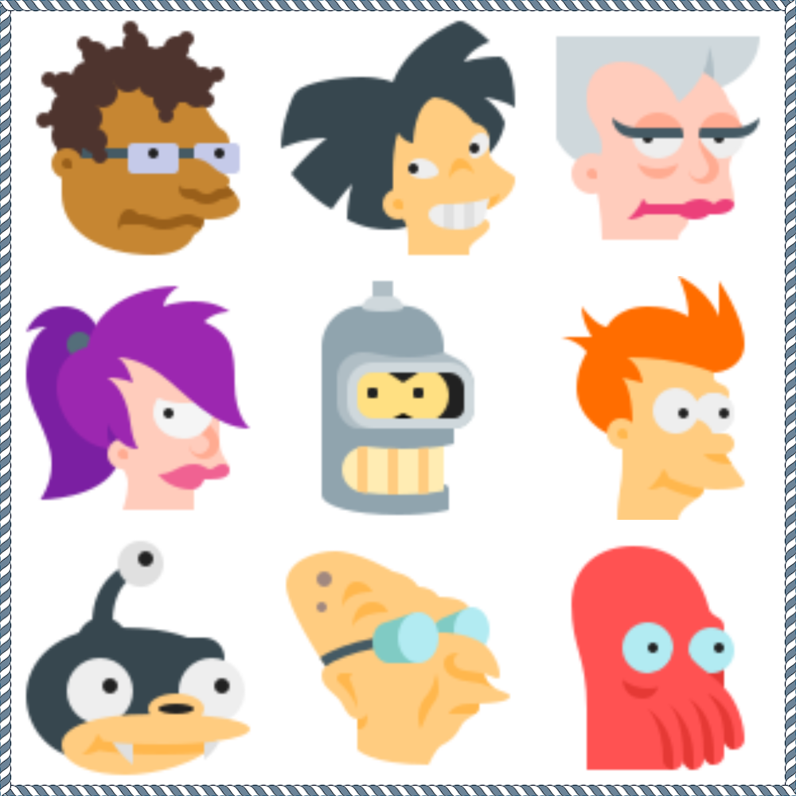
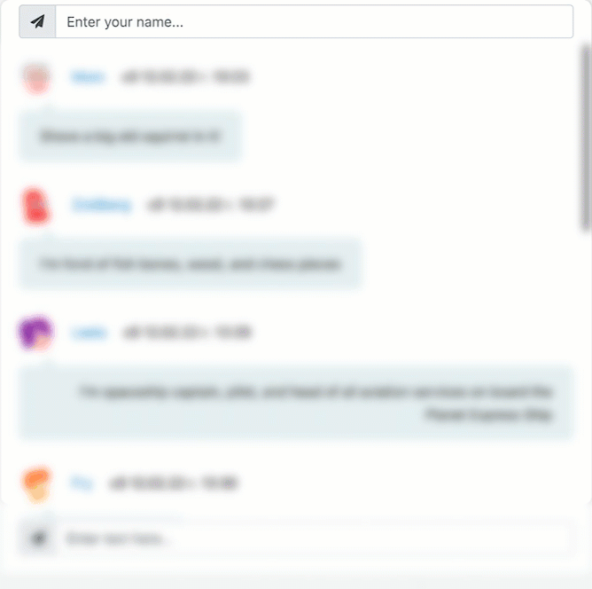

<h1 align=center>
 Chat
   
    
   
</h1>  

  

## Chat is  a live app, when you should only set your nick, no registration no authorization. Start communicating here and now.  

  

## 🪄 Features

- Funny Futurama [avatars](https://github.com/rodionbgd/chat/tree/main/src/img) 
- Firebase RTDB
- Instant updates, thanks to EventSource, provided by Firebase API
- Application state is managed by redux, redux-thunk
- Minimal, but awesome UI

# Support
Please [open an issue](https://github.com/rodionbgd/chat/issues) for support or even more [open a pull request](https://github.com/rodionbgd/chat/pulls).

# License
This project is open source. Enjoy using it.

# Contacts
Don't hesitate to ask me whatever you want. Stay tuned for more awesome projects :smile:. Follow me or Connect me via <a href="https://t.me/rodionbgd">Telegram</a>.
